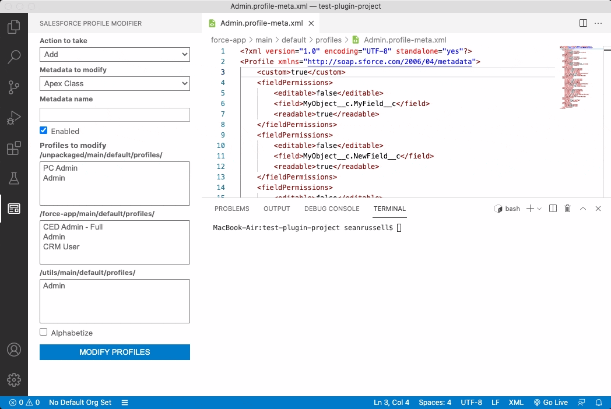
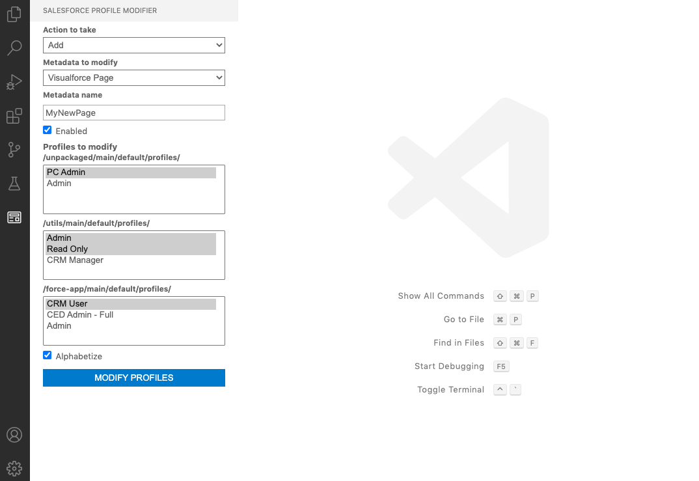
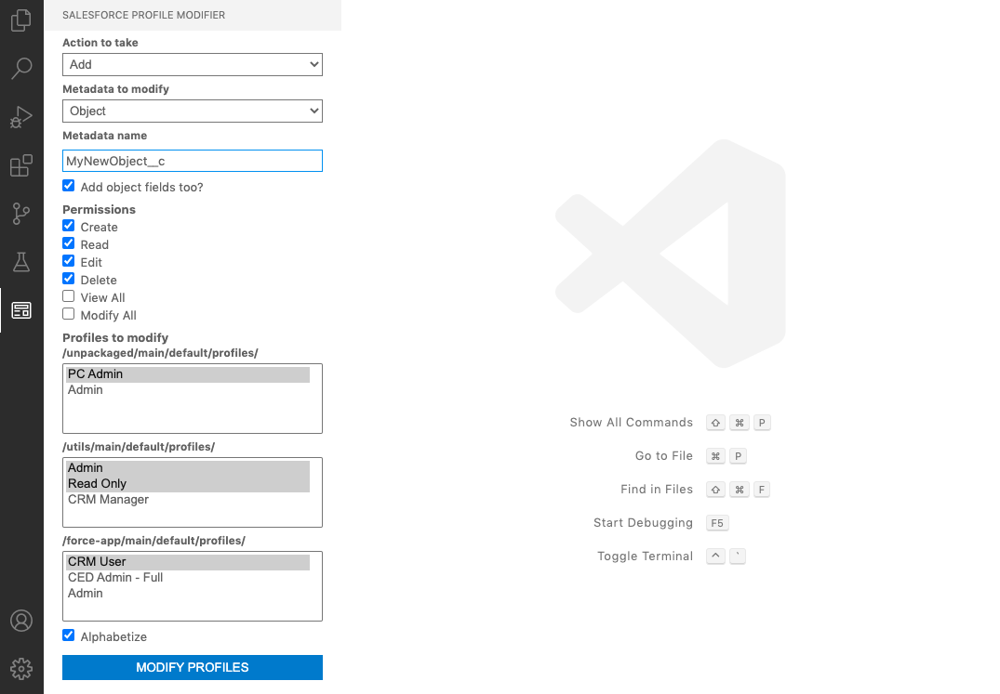
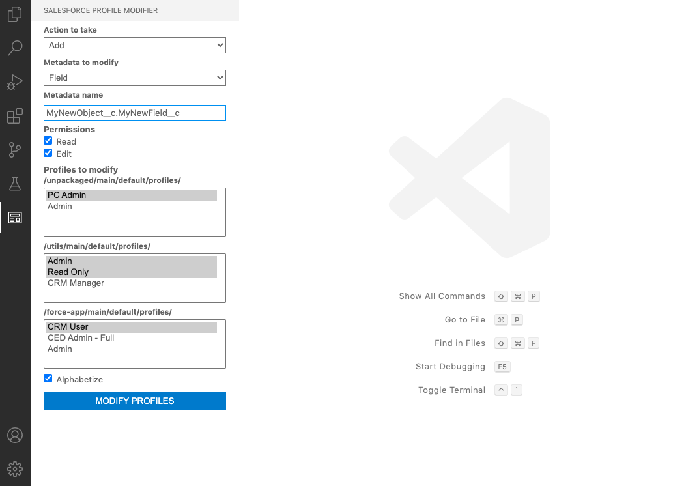

# Salesforce Profile Modifier Extension 

**Note that this plugin is not officially supported by Salesforce. I created this extension to ease the repetitiveness of having to add metadata to profiles.**

Provides ability to add, edit, and remove Apex Class, Visualforce Page, Object, and Field metadata from salesforce profiles within an SFDX project structure. This extension requires users to have SalesforceDX CLI and also profile-modifier-plugin (run **sfdx plugins:install profile-modifier-plugin**) for SalesforceDX CLI.

# Prerequisites

This vscode extension works only once you have installed Salesforce CLI and a profile-modifier-plugin (run **sfdx plugins:install profile-modifier-plugin** on your terminal) that has api for all the commands this extension leverages.

1. Install SalesforceDX CLI from https://developer.salesforce.com/tools/sfdxcli based on your operating system.
2. Install profile-modifier-plugin using the command `sfdx plugins:install profile-modifier-plugin`. Note that if you have already installed the plugin, then make sure to update to latest always using `sfdx plugins:update`
3. VScode version 1.30 and beyond
4. You have project workspace set up and have sfdx-project.json file in the root folder. 
5. Extension is shown in the right hand menu with the icon 

# Features

1. **Add, edit, or remove Apex class metadata from profiles**
    

2. **Add, edit, or remove Visualforce Page metadata from profiles**
    

3. **Add, edit, or remove Object metadata from profiles**
    

4. **Add, edit, or remove Field metadata from profiles**
    

# Release Notes
### 0.0.1

1. Intial release of extension. Provides the ability to add, edit, and remove Apex class, Visualforce page, Object, and Field metadata from profiles

-----------------------------------------------------------------------------------------------------------

### For more information on the SFDX CLI plugin that this extension makes use of, please see:

* [Profile Modifier Plugin](https://github.com/seanrussell/profile-modifier-plugin)
